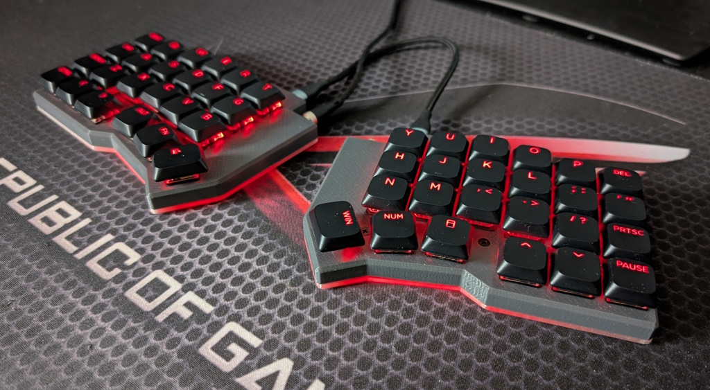

# Cornedeon Keyboard
## Based on Corne Keyboard [CRKBD](https://github.com/foostan/crkbd)
Improved Corne 3 keyboard with full 4x6 matrix.

Keyboard Maintainer: [alk0](https://github.com/alk0-kbd/) [alko-kbd@alk0.ru](mailto:alko-kbd@alk0.ru)

Hardware Supported: Corne 3 PCB, Handwired, RP2040

## Revisions

rev2 - promicro rp2040

rev2z - rp2040 zero

## Build

Prepare vial-qmk [environment](https://get.vial.today/docs/porting-to-vial.html).

Copy its into /keyboards/alko/cornedeon.

qmk compile -kb alko/cornedeon/rev2 -km vial
